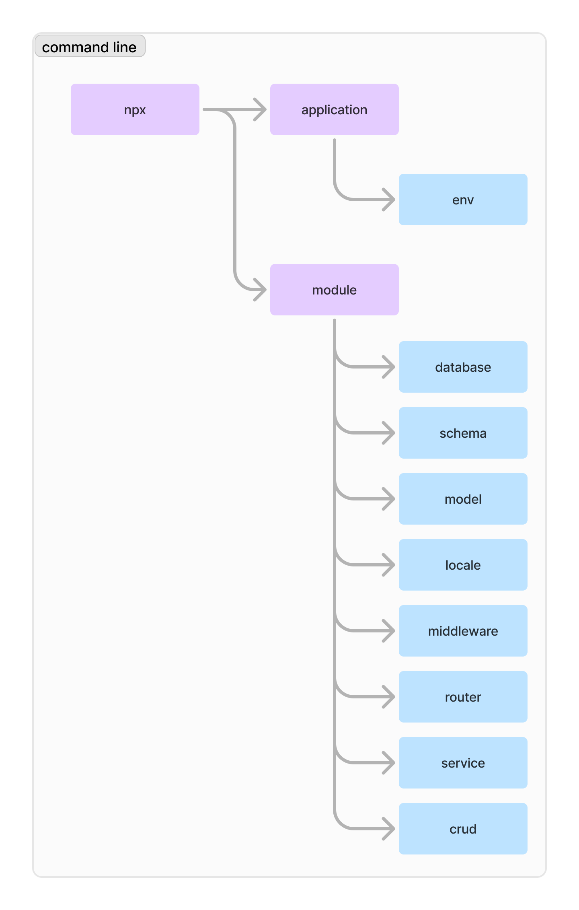

<h1  align="center">mikrocms tools</h1>

Interactive tool for intergrate with mikrocms.



## Application

```bash
npx mikrocms
```

Creating a new mikrocms application scaffold.

## Application Environment

```bash
npx mikrocms env {environment_name}
```

Adding a new application environment or modified exsiting application environment.

## Module

```bash
npx mikrocms module
```

Creating a new mikrocms module scaffold.

## Module Database

```bash
npx mikrocms database {connection_name}
```

Adding a new module database connection or modified exsiting module database connection.

## Module Schema

```bash
npx mikrocms schema {schema_name} {connection_name}
```

Adding a new module schema or modified exsiting module schema.

## Module Model

```bash
npx mikrocms model {model_name}
```

Adding a new module model or modified exsiting module model.

## Module Locale

```bash
npx mikrocms locale {language_code}
```

Adding a new module locale or modified exsiting module locale.

## Module Middleware

```bash
npx mikrocms middleware {middleware_name}
```

Adding a new module middleware or modified exsiting module middleware.

## Module Router

```bash
npx mikrocms router {endpoint}
```

Adding a new module router or modified exsiting module router.

## Module Service

```bash
npx mikrocms service {http_method} {endpoint} {endpoint_router} {module_router}
```

Adding a new module service or modified exsiting module service.
